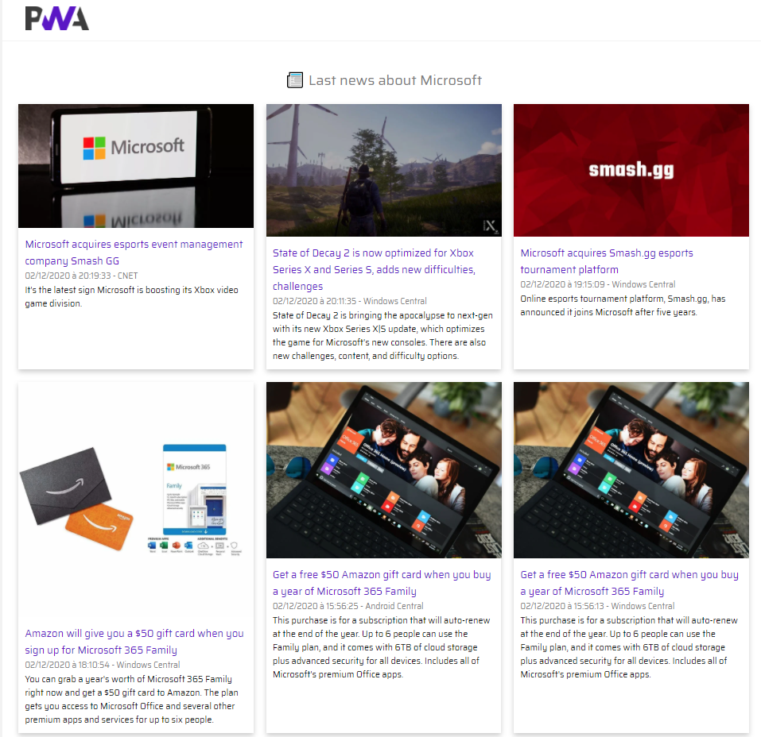

# PWA Demo - Custom News Reader

This project is a PWA demo with no JavaScript Framework to keep it simple. It simply displays news from GNews.io API.

[Live demo](https://blue-mushroom-01e03f003.azurestaticapps.net/)

## Quick start

### Live Server
With VS Code, you can install a local development server with [Live Server](https://marketplace.visualstudio.com/items?itemName=ritwickdey.LiveServer).
- Open index.html with Live Server

### Remotely
You can use a service like Microsoft Azure Static Web Apps (Preview) to host the PWA. Otherwise, you can use Netlify or Firebase.
